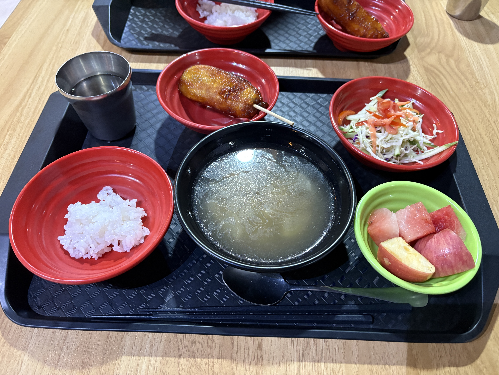
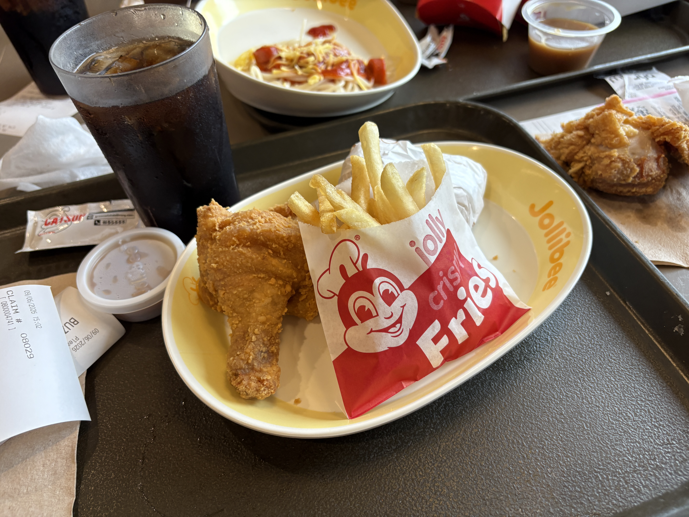
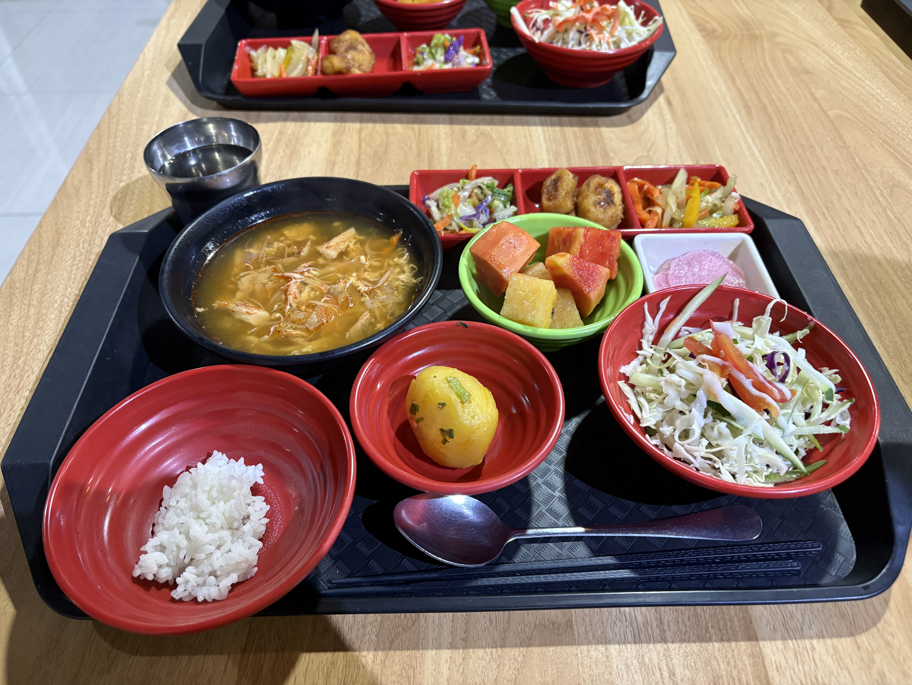
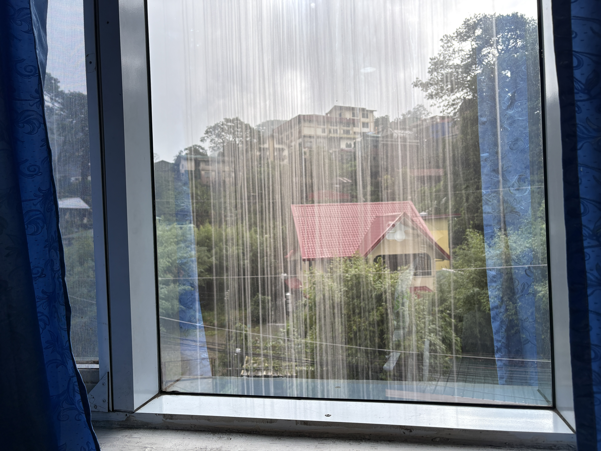

I moved to Baguio from Manila in a van.  
I was exhausted, so I slept well.  
It was colder than I expected.

I went to SM Mall Baguio with my batchmates, Aki 🇯🇵 and Wendy 🇨🇳.  
I bought a few things and ate at Jollibee.  
Baguio Jollibee is good, but Cebu hits different.

  
Original

I moved to baguio from Manila with a van.  
I was exthusted, so I slept well.  
It was cold that I expected.

I went to SM Mall Baguio with my batchmates which is Aki🇯🇵 and Wendy🇨🇳.  
I bought something and ate Jolibee.  
Baguio Jolibee is good, but Cebu hits different.

