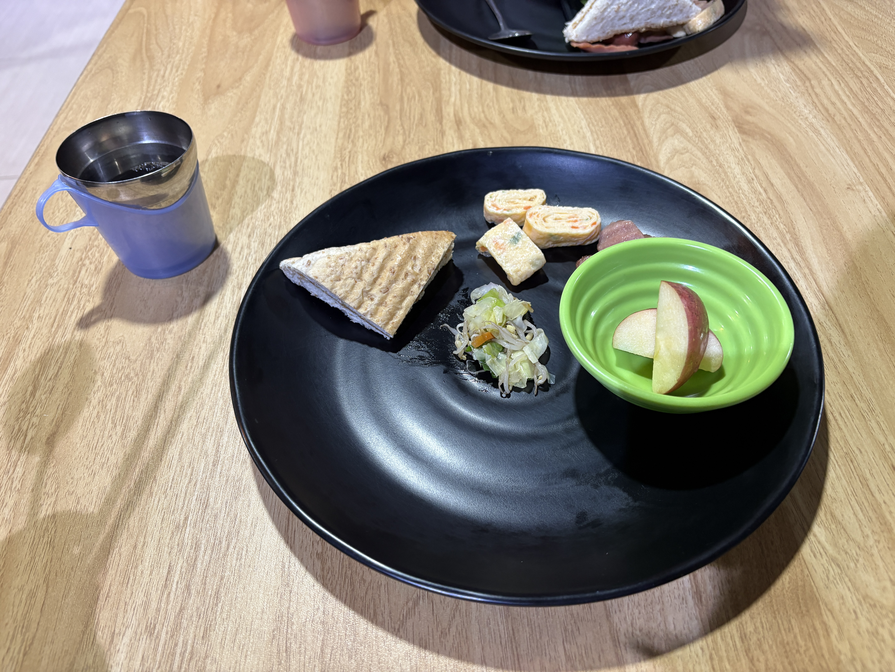
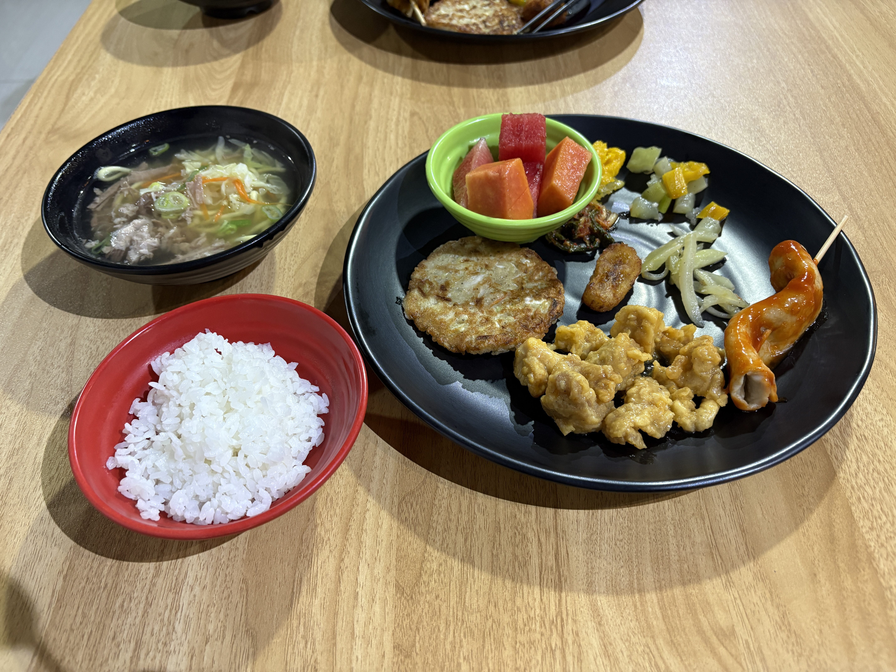
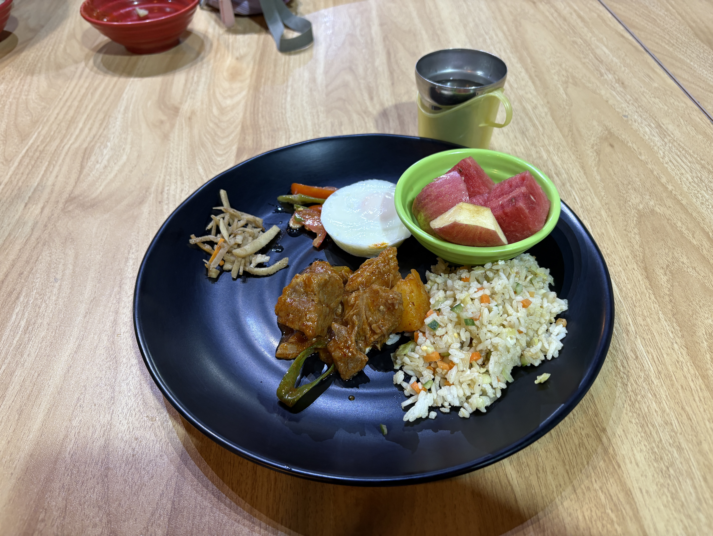

I took an IELTS mock test today.

I was expecting the results to be terrible, but they weren't as bad as I thought. My Writing and Speaking scores were both 5.0, which wasn't too bad.

My overall score was actually 4.5, though, mainly because I got 4.5 in Listening and only 3.0 in Reading. 😇

The mock test result was pretty bad, but I got an overall score of 5.5 six months ago.

So... I still believe I can get a 6.5. 😂

After the exam, I went to SM Mall Baguio with Aki🇯🇵 and Nao🇯🇵.

Classes have finally started.

I feel anxious, but I'll give it my best shot.

  
Original

I took an IELTS mock exam.  
I expected conclution, but it was not so bad because Writing and Speaking are 5.0.  
Actualy Overall is 4.5 since Listening is 4.5 and Reading is 3.

Mock test's result is so bad, but I've got 5.5 6 months ago.
so I think I can get 6.5.

After taking an exam, I went to SM Mall Baguio with Aki🇯🇵 and Nao🇯🇵.

Classes are finally started.  
I feel anxiety, but I'll do my best.

### Conclution

- L 4.5
- R 3
- W 5
- S 5

OA 4.5

