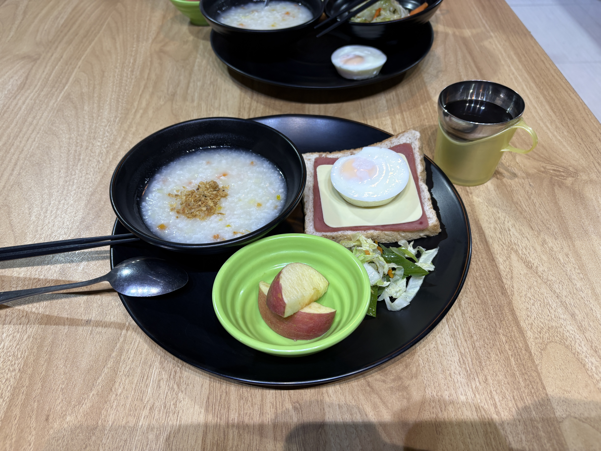
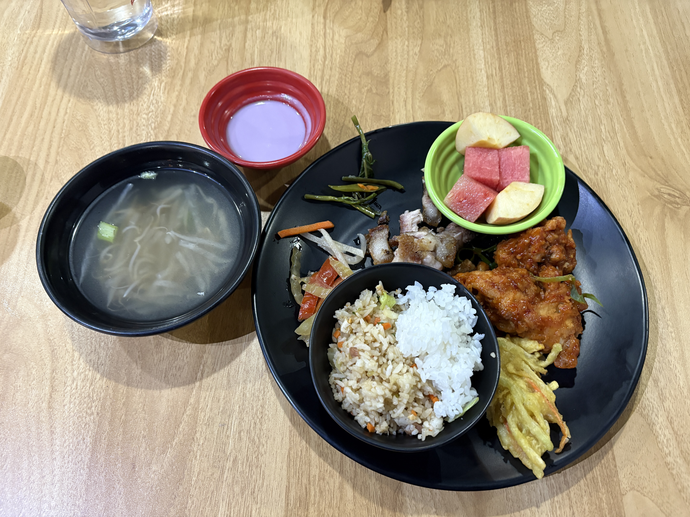
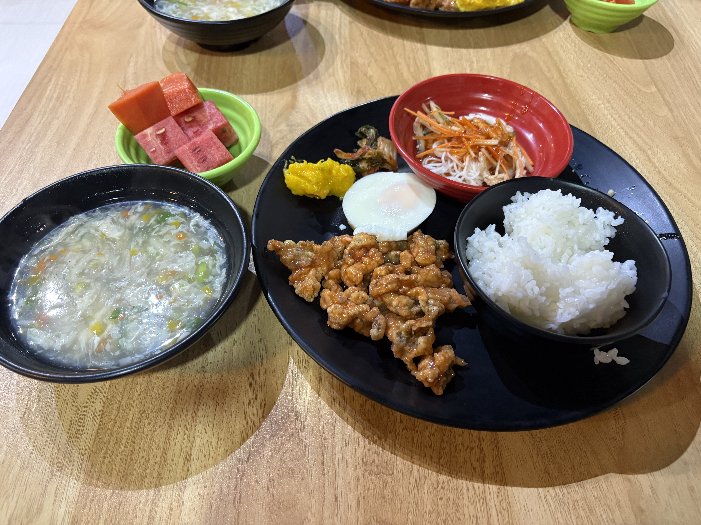

Today was my first full day of classes.

I had four one-on-one classes, three group classes, and three hours of self-study.  
And starting tomorrow, I’m adding two optional classes to the mix.  
My schedule is getting pretty packed!

I’ve also made some friends from Japan 🇯🇵 and China 🇨🇳.  
Everyone is so kind, which makes me feel really comfortable here.

I realized that I didn’t know much about IELTS writing techniques. That probably explains why my writing score isn’t very good.

I didn’t study much for the IELTS before coming here, but I can already feel my English improving.

I want to make the most of my time in Baguio 🇵🇭 and, most importantly, enjoy the experience!

  
Original

It is my first time to take full classes.  
I have 4 classes of 1 on 1 and 3 group classes, and self study for 3 hours.
I also take 2 option classes from tomorrow.

I made some friends🇯🇵🇨🇳.
Everyone is so kind.

I didn't know about writing technic.  
That's why my writing score is not good, I guess.

I didn’t  study a lot about IELTS.  
My English is certainly getting improve, I guess.

So I want to enjoy during studying abroad in Baguio🇵🇭.

