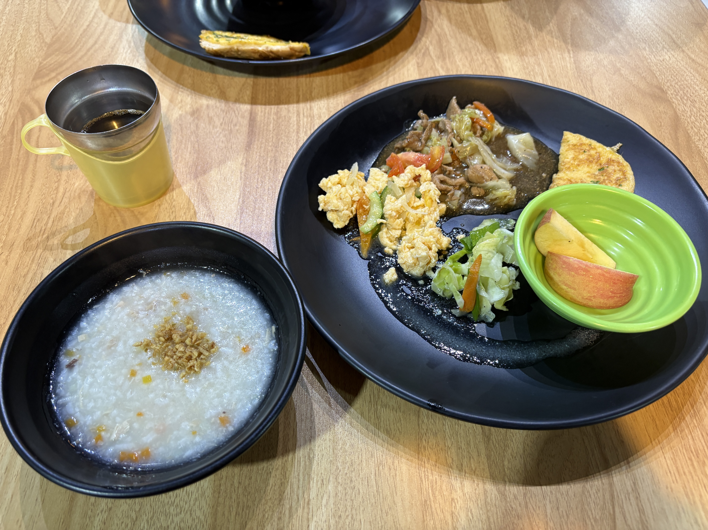
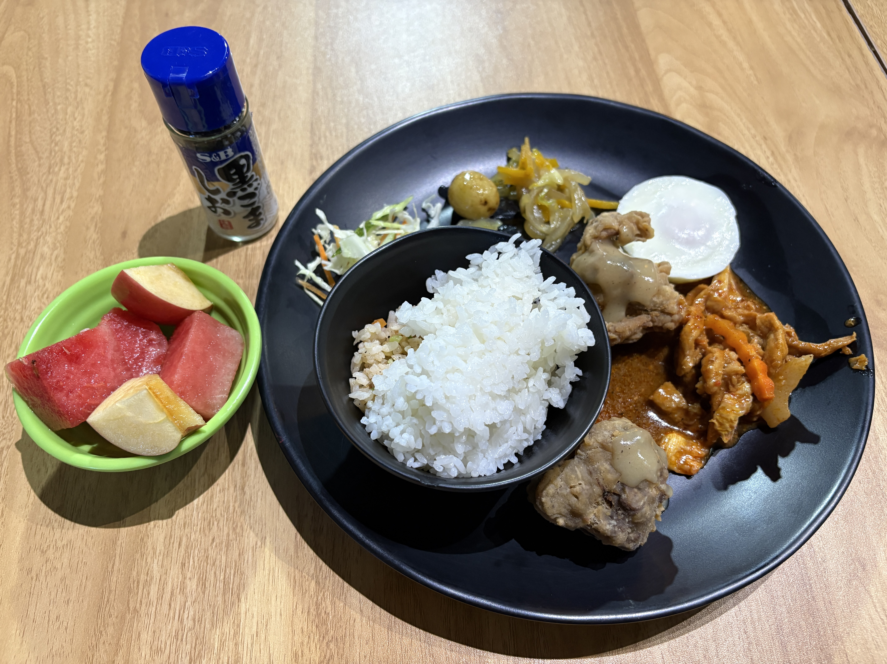

I’m finally getting used to life and studying here.  
Both of my optional classes have been really enjoyable so far.

My roommate, Wendy, caught a cold, so I’m a little worried about her.  
She doesn’t seem to have a fever—just a runny nose. Hopefully she’ll be feeling much better tomorrow.

I had lunch with Iori 🇯🇵 today.  
It’s fascinating how different the Main Campus and the IELTS Campus are. They have completely different atmospheres.

I think the food here is starting to taste better.  
Or maybe I’ve just gotten used to it. 😂

  
Original

I've gotten used to live and study in the school.

2 Option Class are both fun.

My roommate Wendy have a common flu, so I worry about her.  
she maight not have a fever, only has running nose.  
I hope that her codition could be better than today.

I ate lunch with Iori🇯🇵.  
It's interesting that it is difference between Main campus and IELTS campus.

  
Fixed

I’ve gotten used to living and studying at the school.  
The two optional classes are both fun.

My roommate, Wendy, has a common cold, so I’m worried about her.  
She might not have a fever; she only has a runny nose. I hope she’ll feel better tomorrow.

I ate lunch with Iori 🇯🇵.  
It’s interesting that there is a difference between the Main Campus and the IELTS Campus.

