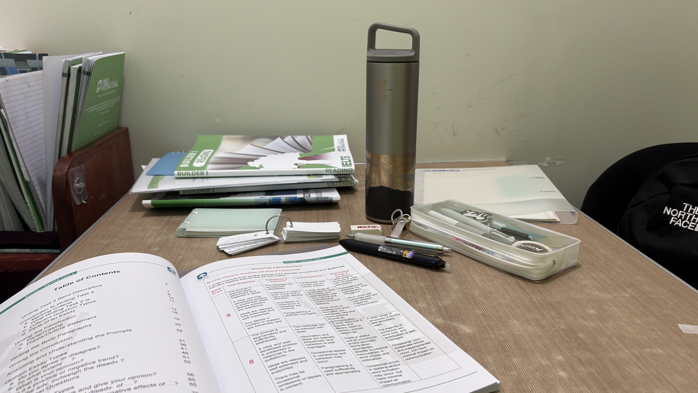
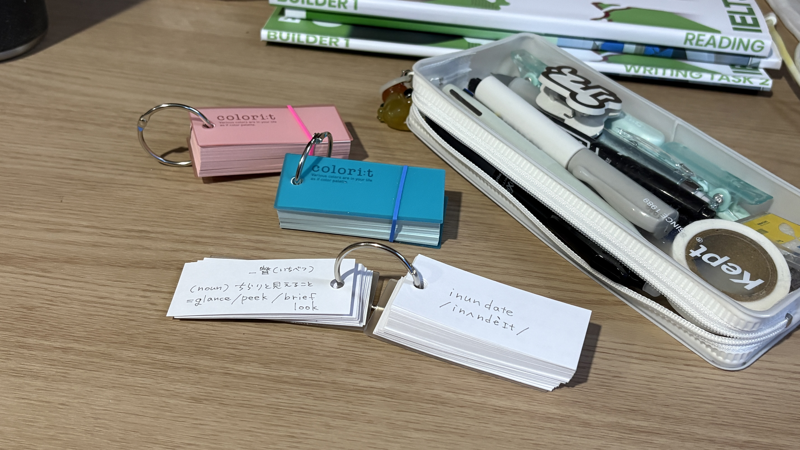
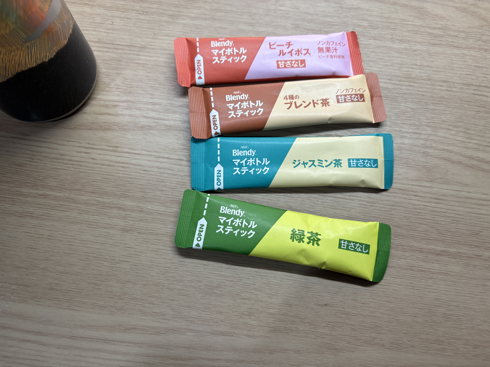
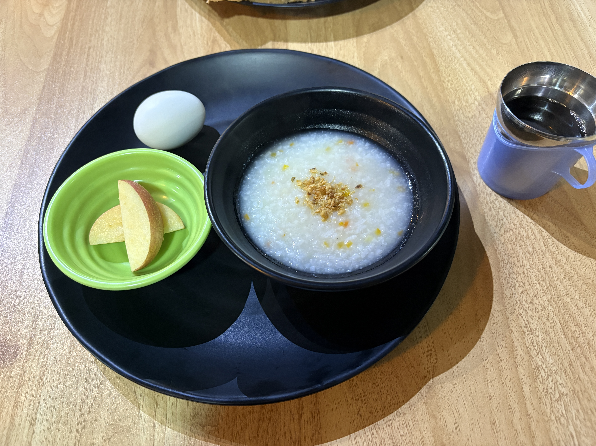
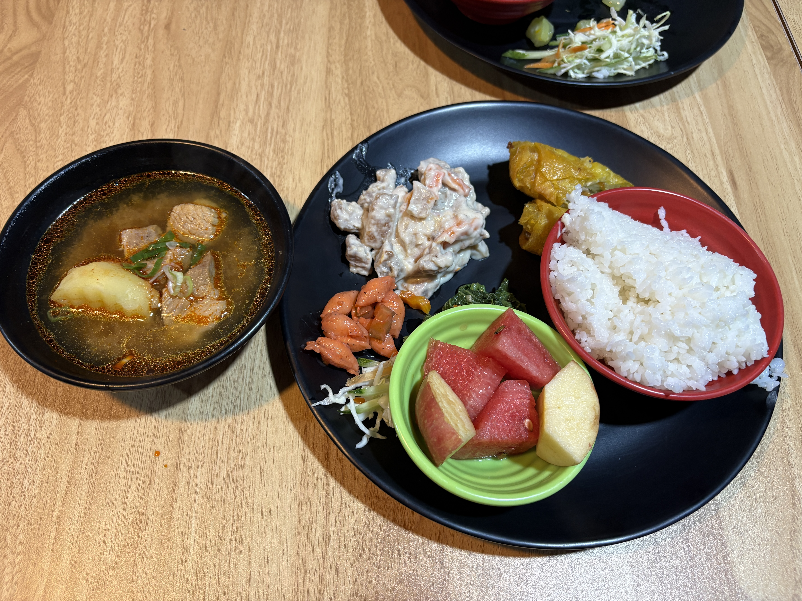
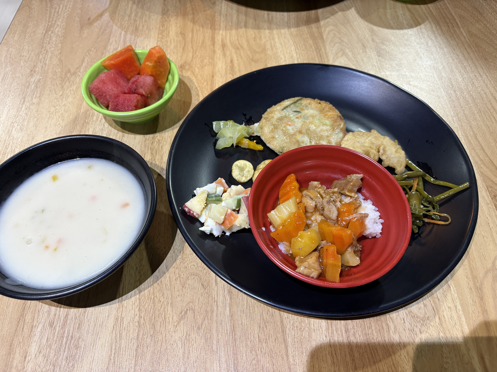

I had a few homework assignments today.  

I had some free time, so I did some research on Banaue and Vigan City.  
I’d love to visit them when I get the chance.

Later, Wendy and I somehow ended up talking about marriage.  
It was fascinating to hear about the differences between Chinese and Japanese cultures.

I really respect Eigo Otaku Miyu, so I decided to make my own flashcards based on her materials.

Bringing some tea with me helps me feel calm. 🍵

  
Original

I have a few homework today.  
I searched about Banaue and Vigan city that I want to go as I hava time to do that.

My roommate, Wendy, and I were chatting about marriage.  
It is interesting the difference between Chinese and Japanese culture.

I respect Eigo Otaku Miyu, that's why I made Flashcards.  
(image)

bringing teas is good as it calms me down🍵. 
(image)

  
Fixed

I had a few homework assignments today.  
I had some free time, so I did some research on Banaue and Vigan City because I want to visit them when I have time.

My roommate, Wendy, and I were chatting about marriage.  
It was interesting to learn about the differences between Chinese and Japanese cultures.

I respect Eigo Otaku Miyu, so I made some flashcards.

bringing teas is good as it calms me down🍵

