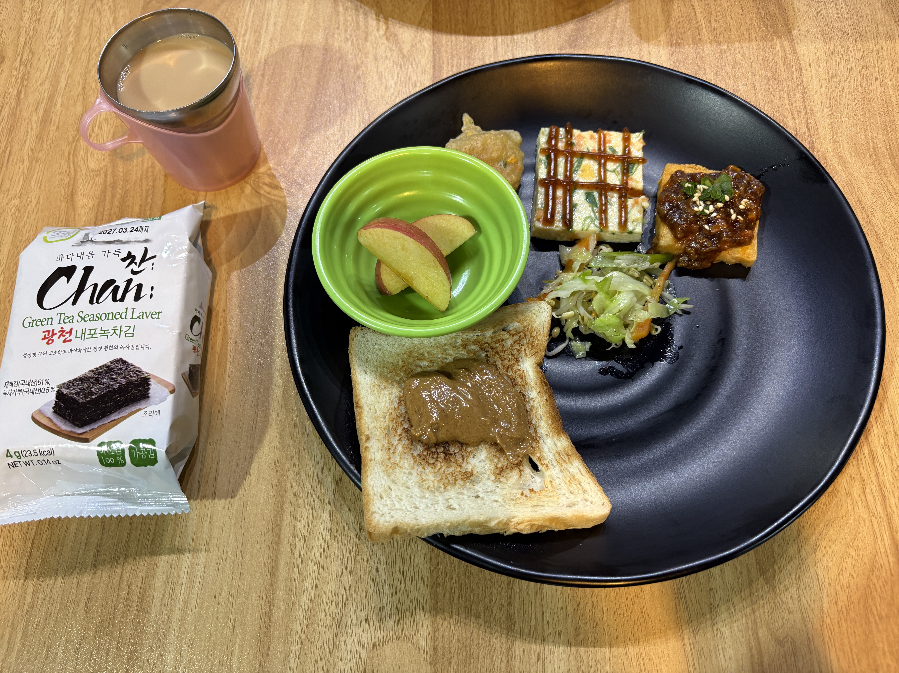
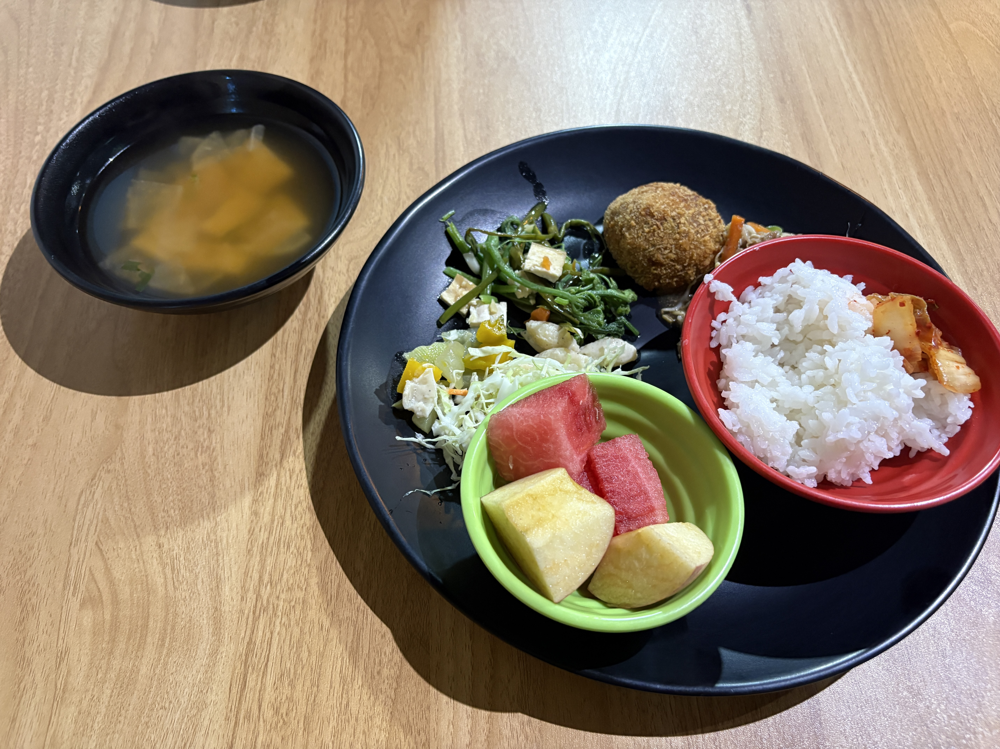

Every Friday, we have a listening quiz that's basically a mini mock test.

I got 25 answers right this time, which gave me a band score of 6.0.  
I was just two spelling mistakes away from a 6.5!  
I definitely need to build up my vocabulary and learn more synonyms.

It was sunny for most of the day, which was nice.

After class, I walked around the school with Sunny🇨🇳 and Tiffany🇻🇳.  
It felt so good to get outside because I hadn't really been out since classes started.

And finally, I'm done with classes for the week!  
Time to enjoy the weekend ☀️

  
Meals

  
Original

I have a quiz of listening which is like mock test in Fridays.  
I got 25 correct equals 6.0 score.  
Without missing 2 spelling, I'll have gotten 6.5 score.  
I should have more synonyms.

It was almost sunny day.

I walked around in the school with sunny🇨🇳 and tiffany🇻🇳 after Classes.  
I was fun because I didn’t go outside since classes started.

Finally, it ended classes in this week!  
I would enjoy this weekend.

  
Fixed

I have a listening quiz every Friday, which is like a mock test.  
I got 25 correct answers, which is equivalent to a band score of 6.0.  
If I hadn't made two spelling mistakes, I would have gotten a 6.5.  
I should learn more synonyms.

It was sunny for most of the day.

I walked around the school with Sunny🇨🇳 and Tiffany🇻🇳 after class.  
I had fun because I hadn't been outside since classes started.

Finally, this week's classes are over!  
I'm going to enjoy this weekend.

