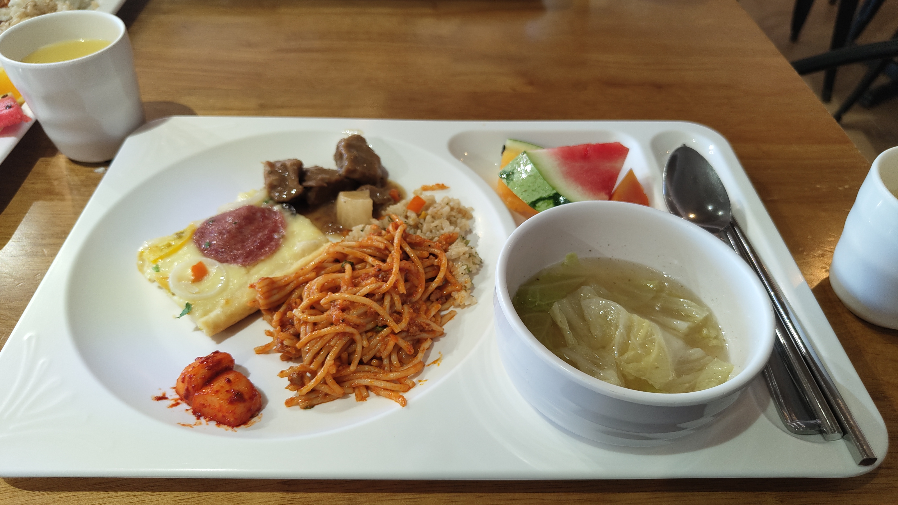
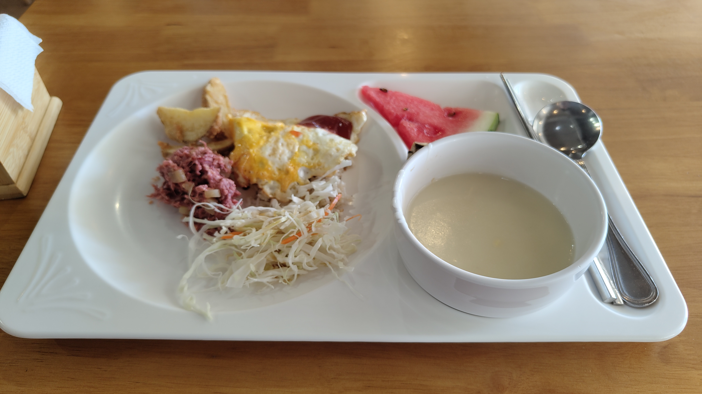
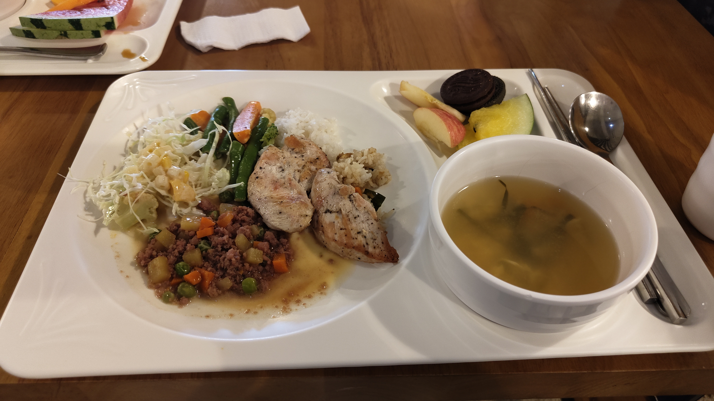
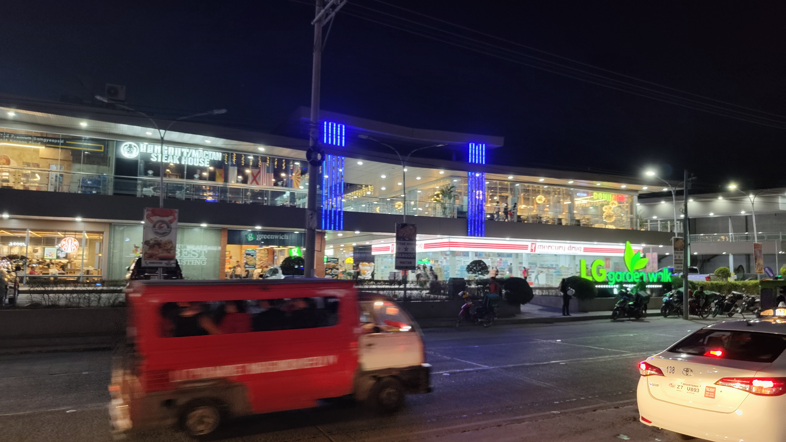
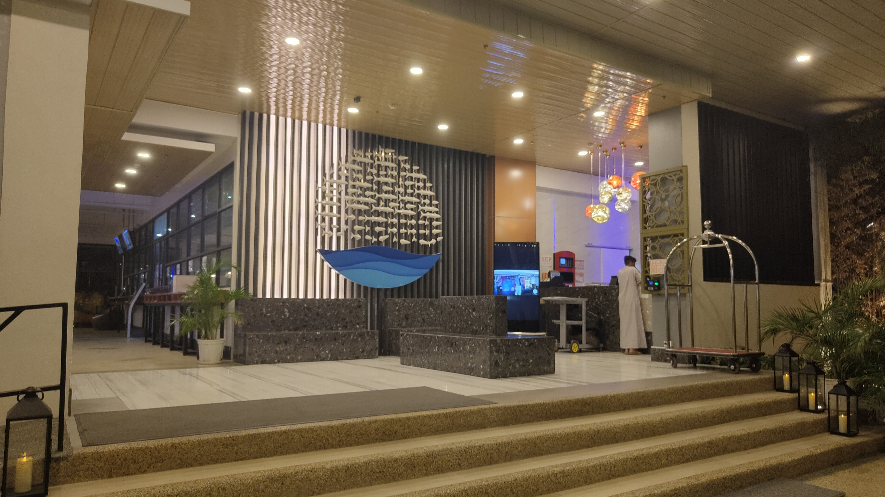

I took a 2-hour exam test. After that, I attended a Japanese orientation.

I made friends with two Japanese women and a Chinese woman.  
We had lunch together.

In the afternoon, I went to Mactan New Town with my friends.  
I drank a mango shake, and it was tasty.

It was fun, and speaking Japanese helped me feel calm.  
I'll do my best starting from tomorrow.

__
breakfast

dinner

LG garden

entrance at CIA

