I went to Bohol Island with my boyfriend.  
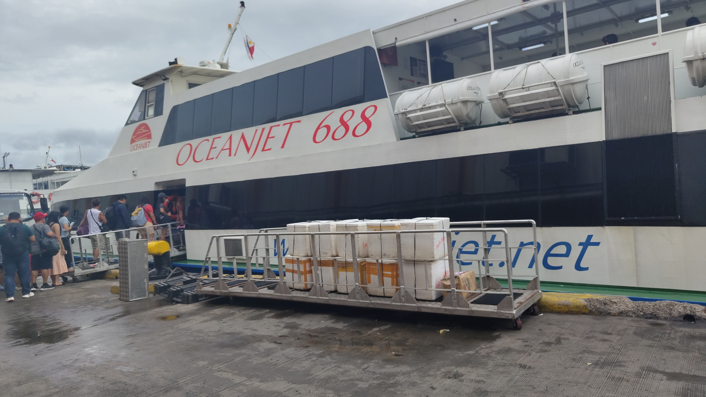
I was able to see Tarsier, the world’s smallest primate.
It was so cute🤍
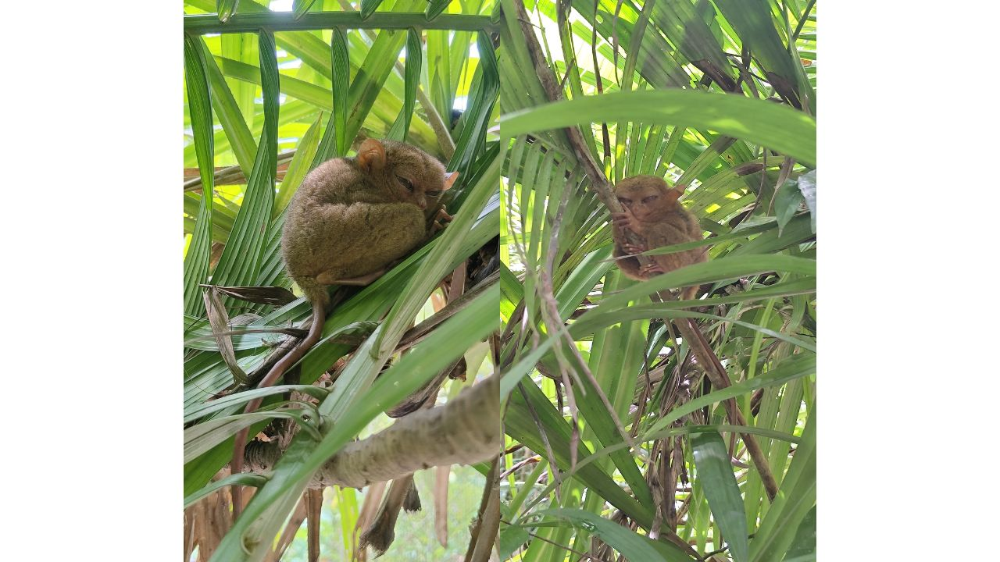

We had a buffet lunch on the ship.  
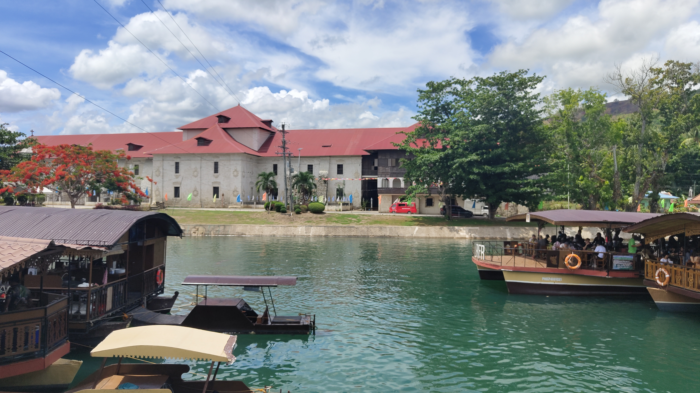
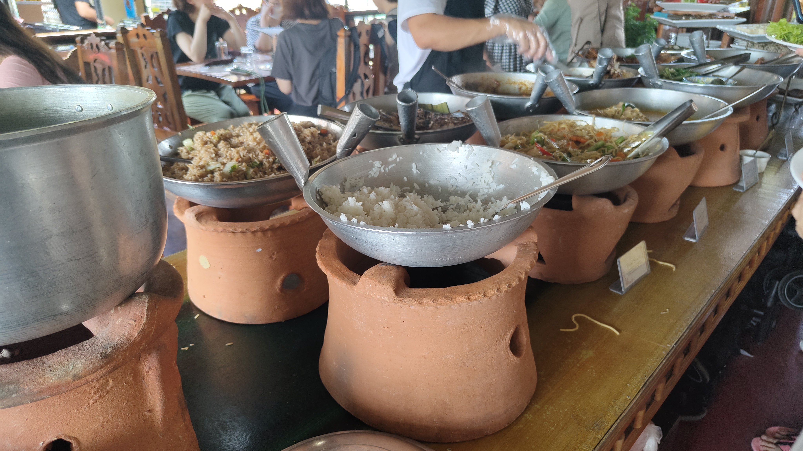
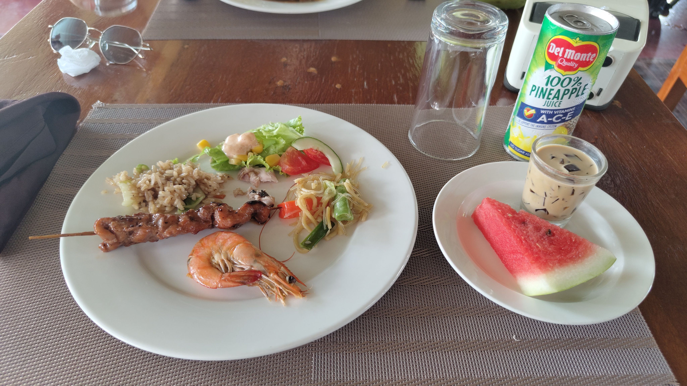
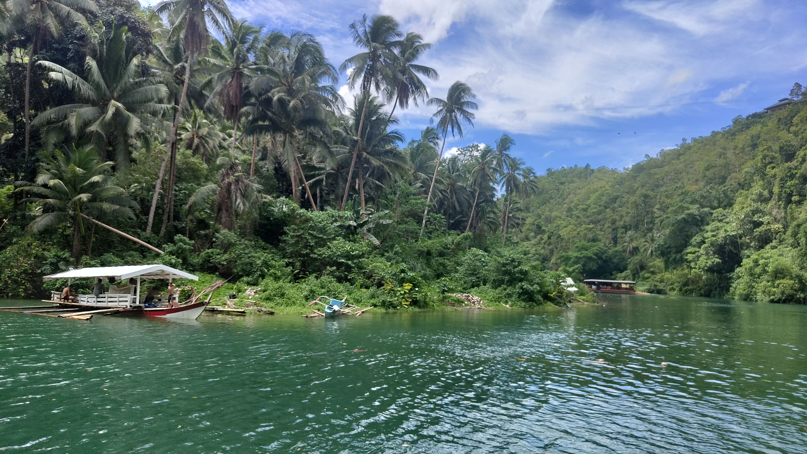

I had a relaxing time, and then I climbed Chocolate Hill.
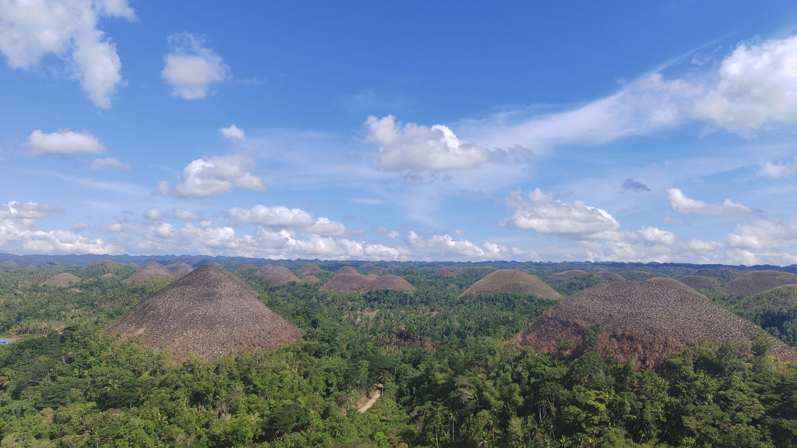

When I met him last week, I wasn’t feeling well,  
so I was happy to see him this week when I was better.

When we were in Japan, we jokingly said, “Let’s go on a date at Jollibee!” lol.  
It was really fun to do.
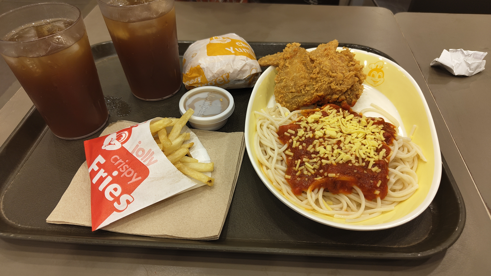

__

I ate breakfast at Jollibee.
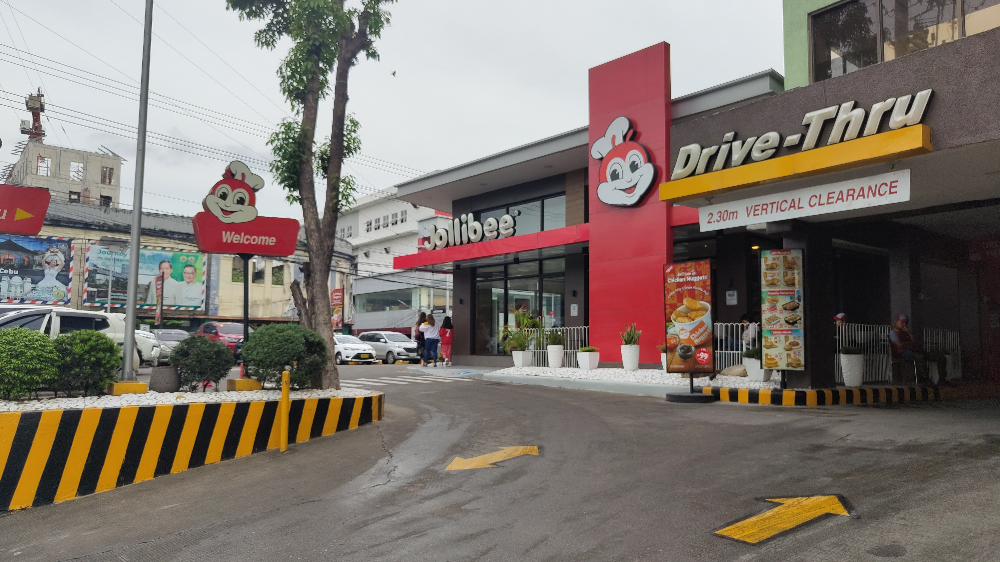
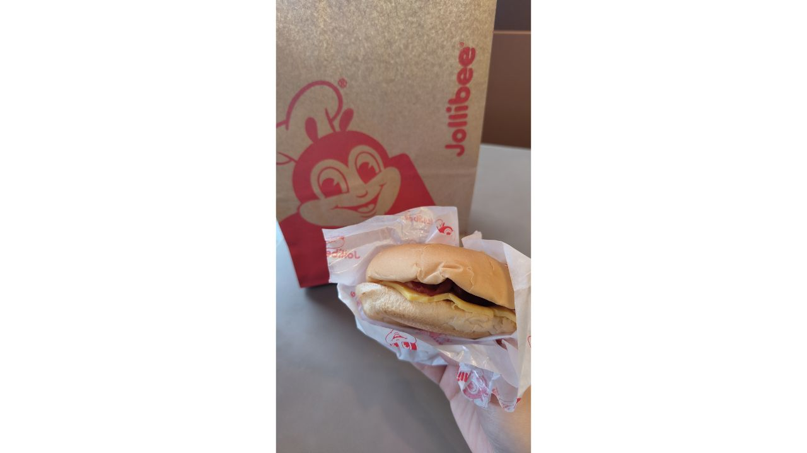

Baclayon Church
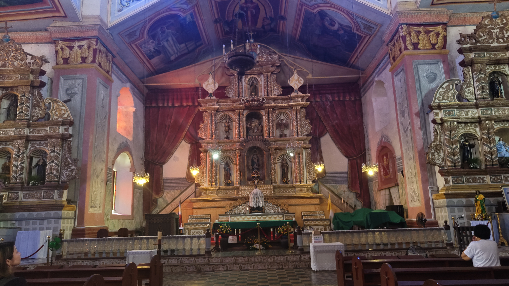

Halohalo
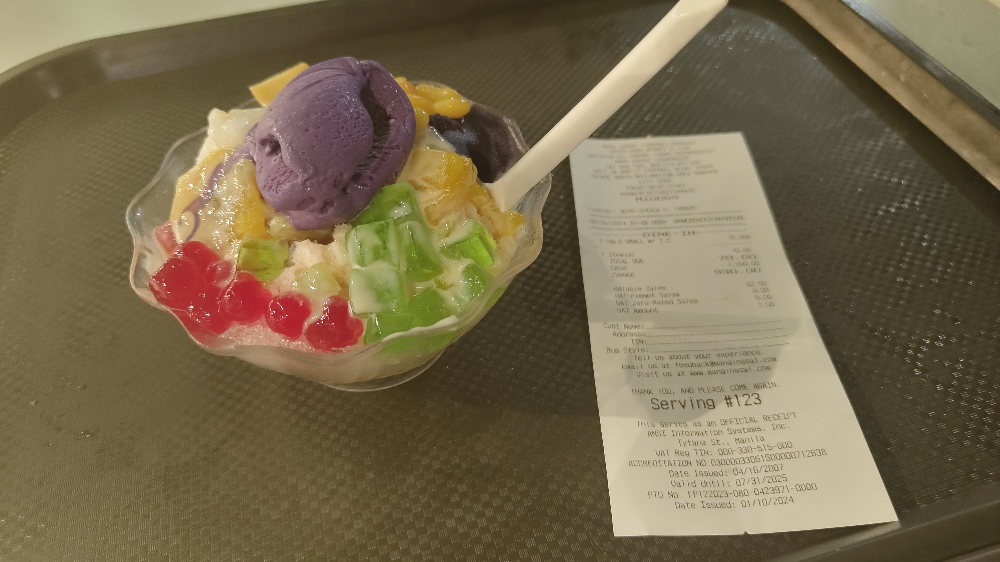

