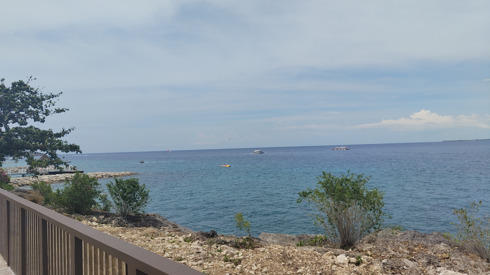
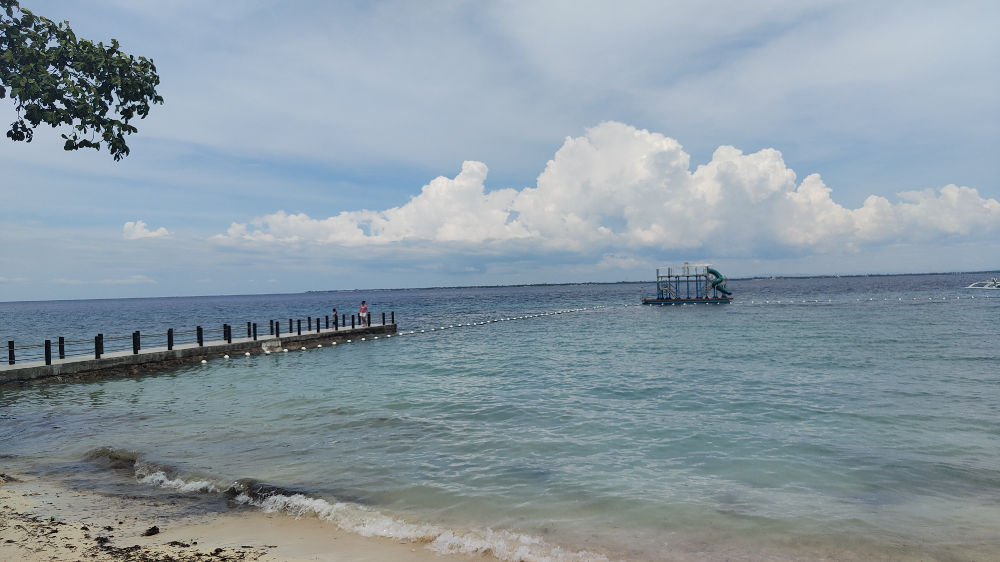
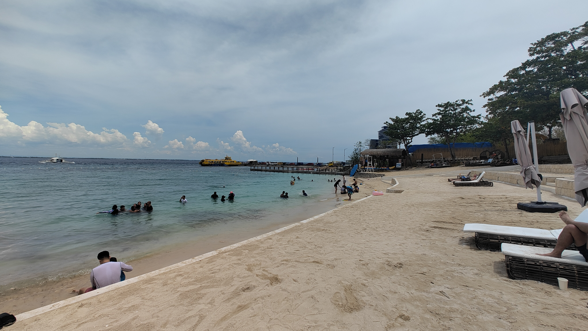

I went to Mactan Newtown Beach with my friend🇯🇵.  
But it was more expensive than I had checked.  
The receptionist told us that the price had changed because the hotel had acquired the beach in 2022.

When I complained to the security guard😤,  
he let us into an area that was under construction.  
But there was no beach, just a beautiful view of the ocean.  

So we talked to him a bit, took a picture with him, and decided to go to the beach,  
even though it was more expensive than I expected.

We swam in the sea, ate lunch, and went back to school.  
It was great to be able to do something unique to a resort area.

