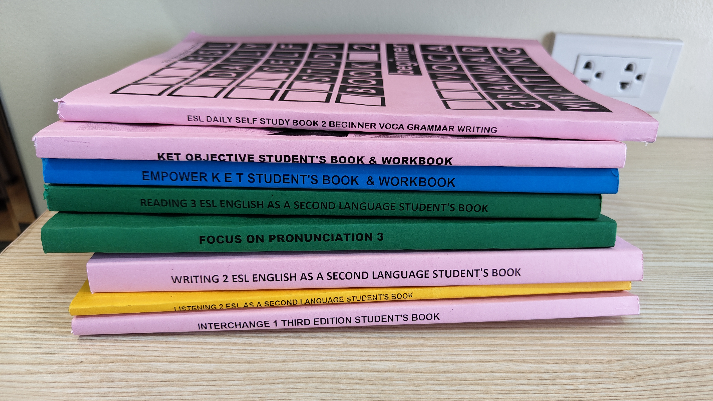
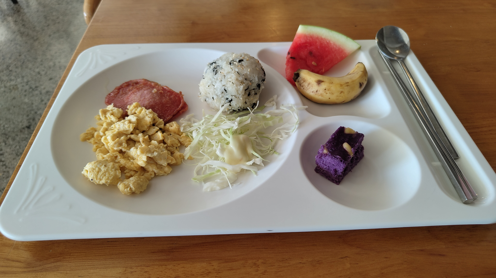
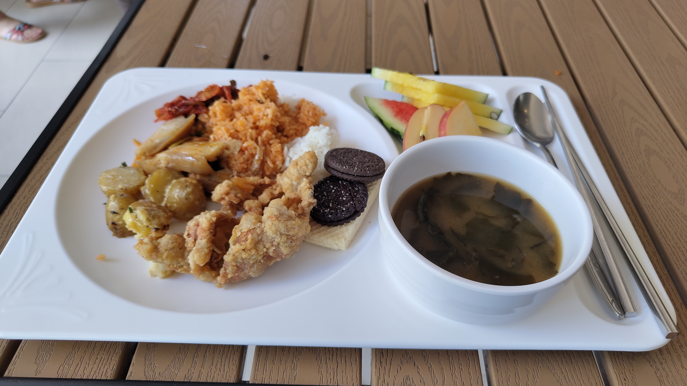
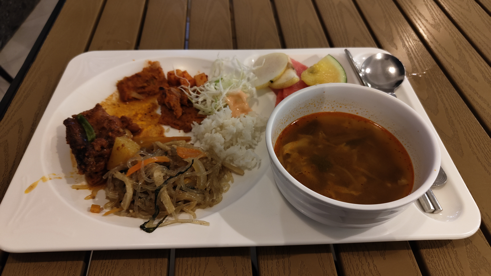
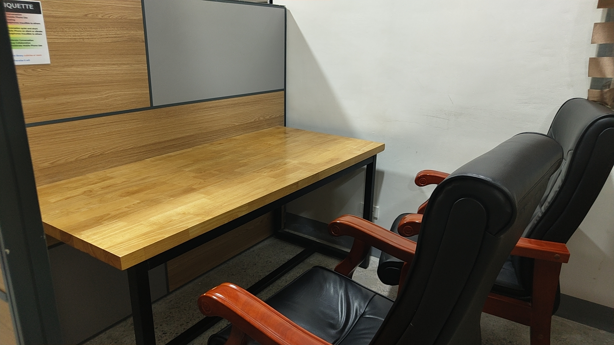

Today was my first day of lessons.  
I encountered a problem: most of the textbooks were different from the ones I had expected for my classes.  
I felt anxious, but by the end of the day, I had fun.

The teacher helped me exchange my textbooks,  
and I talked with students whom I hadn't spoken to yet.

Later, I joined a free night class for an hour.  
There were only three people in the class.  
The teacher was cheerful, and we had a lot to talk about,  
so it was a fun time.

I noticed that I used a lot of filler words and had moments of dead air.  
I think studying for only 3 weeks is short-term,  
but I hope my English improves.

__

breakfast

lunch

dinner

at library
