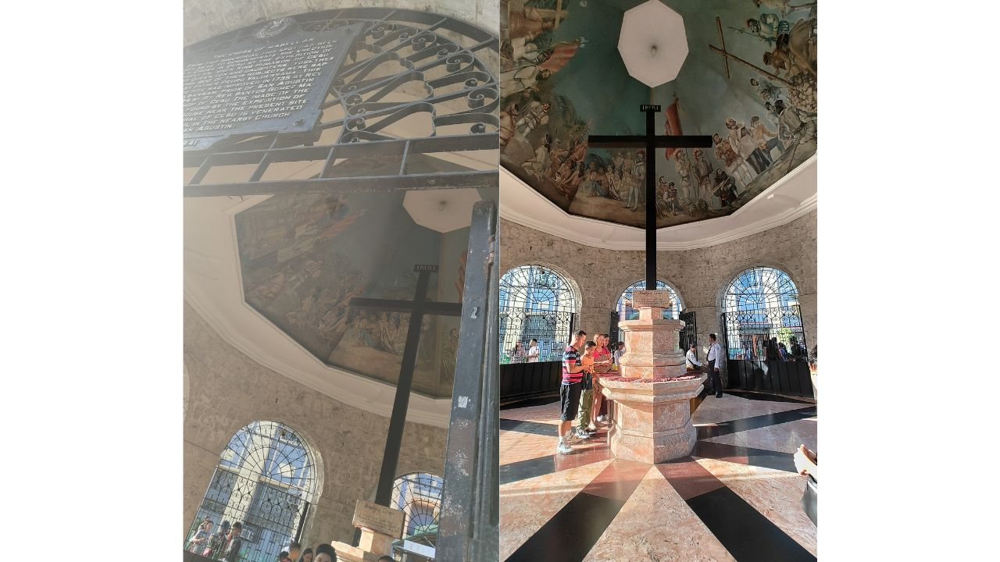
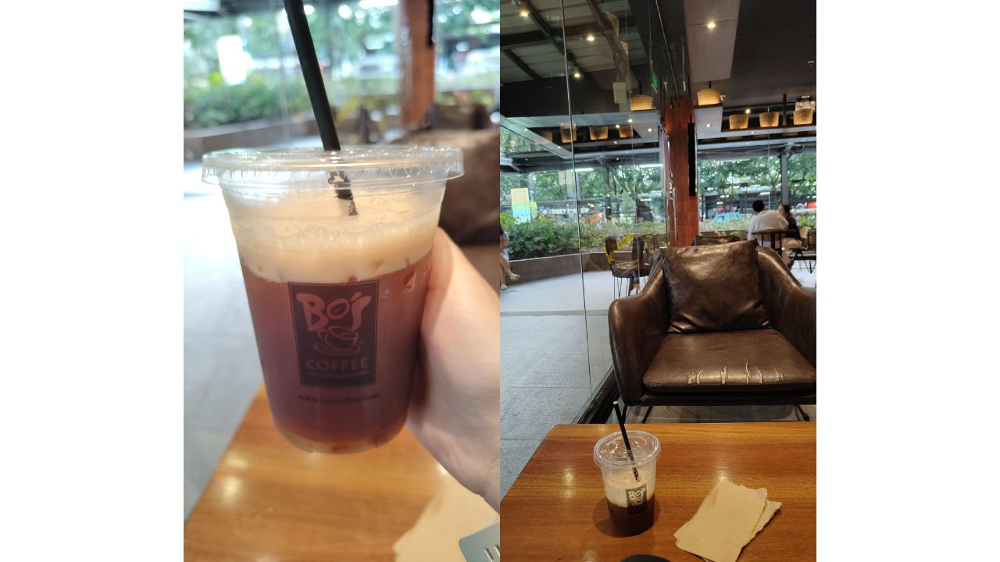

I went to Cebu City alone at my own pace because I was not feeling well.

I watched a movie called IF. I could probably understand 60% of it, but I was moved to tears.

After that, I visited three places:

- Fort San Pedro
- Magellan’s Cross
- Minor Basilica of the Holy Child of Cebu

Fort San Pedro

Magellan’s Cross

Minor Basilica of the Holy Child of Cebu

Finally, I took a walk around the mall with my boyfriend for about 1.5 hours.

I gradually started to feel unwell towards the end of the day, but it was a good day because I was able to do what I wanted.

__

an icecream and a yogurt

lunch
(I didn't like this rice. It  was no taste.)

BO's coffee

cebu city

grocery store

