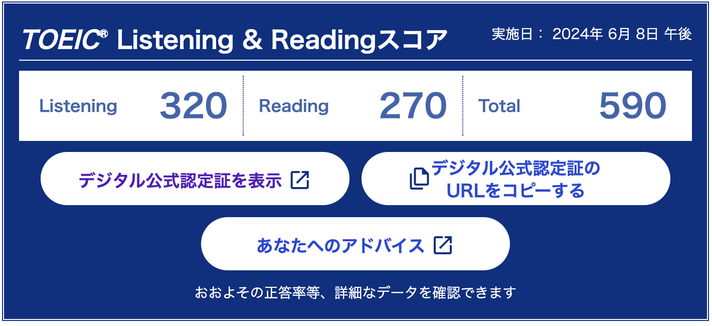
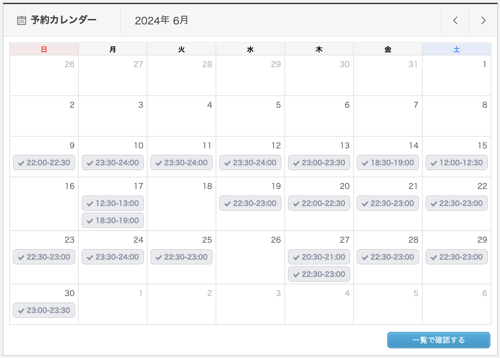

今月から英語学習の振り返りをしていこうと思います。

## やったこと

- TOEIC受検
- オンライン英会話 カランメソッド
- 英単語 金フレ
- でる1000

### TOEIC受検

3週間のセブ留学から帰って1週間後に受けました。  
転職先で仕事が始まった週ということもあり、できた勉強は金フレ1周と出る1000の問題100問くらいでした。

結果は、590点。  
2年前よりは50点上がりました。600点以上欲しかったなぁ。

公式問題集買ったけど、使う時間なかったので他の資格取得が落ち着いたらまた受けたいです。

### オンライン英会話 カランメソッド

21回受けました。
ステージ2の43%まで進みました。

### 英単語 金フレ

3周しました。

最初にガーって2周したら3周目が楽になって良かったです。  
TOEIC終えてからは毎日100問解いてました。

アプリはabceedを使ってましたが、mikanアプリを1年更新で買ってしまっていたので来月からは月額のabceedをやめてmikanでやります。

### でる1000

文法問題集のでる1000は結局TOEIC前の1週間しかやりませんでした。  
来月は1日5問とかからやっていきたいなと思います。

## 課金しているサービス

### サブスク
| アプリ名 | コース | 料金 |
| ------- | --- | ---- |
| mikan   | Premium | ¥12,000/年 |
| abceed  | Pro | ¥3,300/月 |
| QQEnglish | 月30回コース | ¥11,980/月 |

abceedは今月で辞めます。  
もしまたやるならサブスクではなく使いたい教材ごとに購入したい。  
サブスクはオンライン英会話のみにしたいなぁと思ってるから、  
mikanの更新はしないでまたabceedに戻りたいなー、っと思ってます。

### 買い切り
| アプリ名 | コース | 料金 |
| ------- | --- | ---- |
| ELSA Speak | Pro | ¥10,980(買い切り) |
| Callan Method eBook Stage 2 | - | ¥1,760 |

ELSA Speakに買い切りがあることを知ったのでやってみます。  
発音矯正も少しずつやっていく。

## 感想

ディクテーションやろうとか色々意気込んでいたもの、  
気持ちが完全に新しい会社での仕事に行ってしまい思ったほど勉強しませんでした。

来月からは会社の福利厚生でレアジョブも始めるので、  
来月は今月できたこと+レアジョブが継続できれば良いかなと思います！