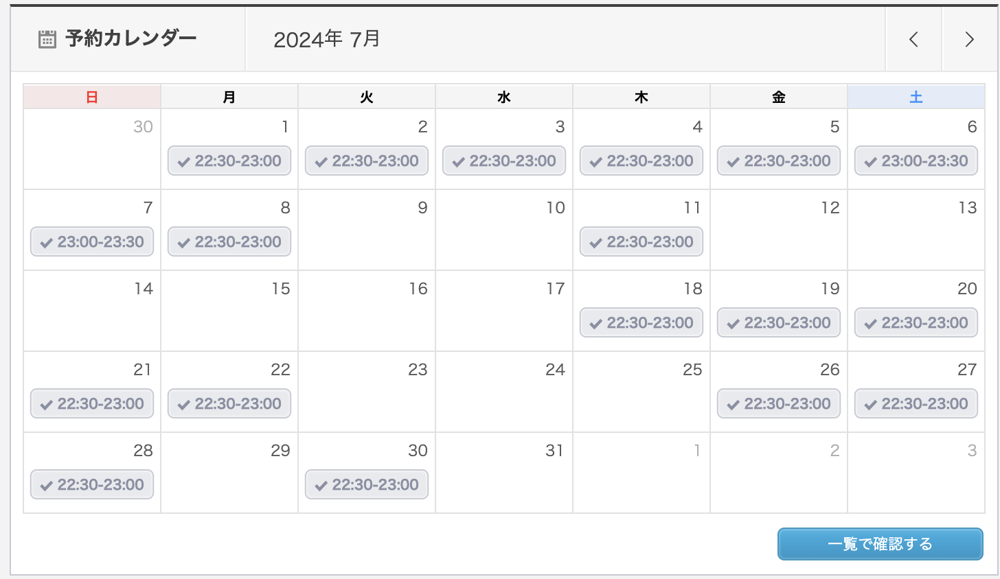

## やったこと

- オンライン英会話 カランメソッド
- オンライン英会話 レアジョブ（実用英会話 レベル4-1）

### オンライン英会話 カランメソッド

18回受けました。  
ステージ2の77%まで進みました。  
先月は43%だったので、34%進められました！！

ぜんぜん予習してなかったのですが（本来は予習不要）、  
やった方が効果ある気がするので  
8月はちゃんと予習取り入れてもっと進むペース上げたいです。

### オンライン英会話 レアジョブ（実用英会話 レベル4-1）

13回受けました。  
60%まで進みました。  
レアジョブの方が進むのが早いけど今のところカランメソッドの方が楽しいです。  
早くお気に入りの先生見つけたい。。。

レアジョブってちょっとしか授業入れてない人多い気がする。

## 課金しているサービス

### サブスク
| アプリ名 | コース | 料金 |
| ------- | --- | ---- |
| mikan   | Premium | ¥12,000/年 |
| QQEnglish | 月30回コース | ¥11,980/月 |
| レアジョブ | 日常英会話コース 毎日25分プラン | 会社の福利厚生 |

英単語の勉強を完全に忘れてました。。。  
8月はmikan再開します。

## 感想

オンライン英会話2種類受けるのは飽きないので結構良いです！！  
オンライン英会話頑張ってたら、英単語やるのを完全に忘れてました。笑

前半は、追い詰められてAWSの資格勉強してたので、  
その割には勉強できてた気がします。習慣化って大事だ。

8月もAWSの資格1つ受けるので今後もマイペースに頑張ります〜