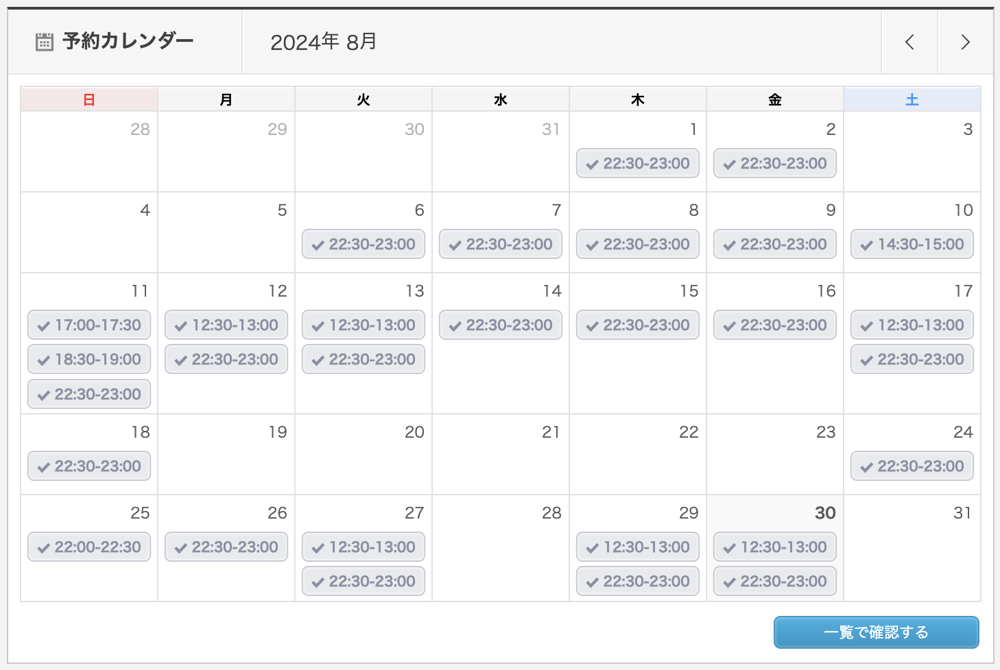

## やったこと

- オンライン英会話 カランメソッド
- オンライン英会話 レアジョブ（実用英会話 レベル4）

### オンライン英会話 カランメソッド

29回受けました。  
ステージ3の27%まで進みました。  
先月はステージ2の77%だったので、50%進められました！！

やる気があるときだけ予習してました。  
慣れてきたのか、予習しなくても文章予測できるようになりました！

### オンライン英会話 レアジョブ（実用英会話 レベル4）

14回受けました。 

レベル4-2の30%まで進みました。  
先月は、レベル4-1の60%でした。

今月は、ポーズとフィラーが多いとあまり言われなかったです。  
相変わらず文法はぐちゃぐちゃだけど笑、沈黙は少なくなってきた気がします。  

レアジョブはあんまり楽しめてはいないので、しばらくはこのくらいのペースで良いかなぁ。

## 課金しているサービス

### サブスク
| アプリ名 | コース | 料金 |
| ------- | --- | ---- |
| mikan   | Premium | ¥12,000/年 |
| QQEnglish | 月30回コース | ¥11,980/月 |
| レアジョブ | 日常英会話コース 毎日25分プラン | 会社の福利厚生 |

英単語やる気出ないので2日くらいしかやってないです、、、。  
レアジョブやっていて、少し会話するくらいなら単語力はそんなに重要じゃないんだなぁと思いました。  
でも知っている方がもちろん良いのでマイペースに頑張ります。

## 感想

オンライン英会話を受ける習慣がかなりついてきました。    
1〜2年で簡単な会話は詰まらずに話せるところまで持っていきたい！！！

1日3回受けても苦じゃないけど、3回目で「またか、、、」って思ってしまったので2回までがベストだと思いました。

8月のAWS資格は無事に受かりました。  
9月は、11月のAWS資格受験に向けて教材でしっかり勉強するつもりです。

9月もAWSと英語どちらも頑張ります〜  
息抜きに少しずつRustの勉強始める🦀
