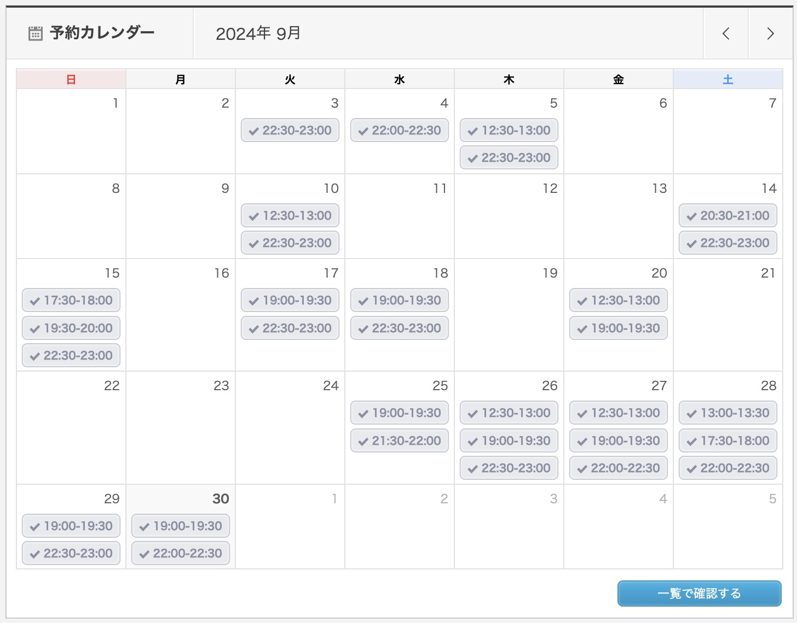

## やったこと

- オンライン英会話 カランメソッド
- オンライン英会話 レアジョブ（実用英会話 レベル4, Weekly News Article）

### オンライン英会話 カランメソッド

30回受けました。  
ステージ3の81%まで進みました。  
先月はステージ3の27%だったので、54%進められました！！

今月は、先月よりしっかり予習してからレッスン受けました。  
レッスン中の復習が結構サクサク進むので、この方法で続けていきたいです。

あと、今月はいろんな先生のレッスンを受けてお気に入りの先生を増やしました。  
すごく早く進めてくれる先生と私が言うまで待ってくれるけどゆっくりペースな先生がいるので、混ぜこぜに受けて進めてます。  
今のところいい感じです。

### オンライン英会話 レアジョブ（実用英会話 レベル4）

10回受けました。 

[Weekly News Article](https://www.rarejob.com/lesson/material/wna/)を主に受けました。

英語を話す以前に、何か意見を持つことが全然できていなくてへこみました、、、。  
頻度低めにして、しっかり予習して意見固めて受ける感じにしようかなと思います！！

(また英語嫌いになりたくないーー)

## 課金しているサービス

### サブスク
| アプリ名 | コース | 料金 |
| ------- | --- | ---- |
| mikan   | Premium | ¥12,000/年 |
| QQEnglish | 月30回コース | ¥11,980/月 |
| レアジョブ | 日常英会話コース 毎日25分プラン | 会社の福利厚生 |

英単語なんもやってないです、、、。

### 買い切り

| アプリ名 | コース | 料金 |
| ------- | --- | ---- |
| [Clacel2.0](https://service.clacel.com/) | - | ¥39,800 |

Youtuberの[Miyu](https://www.youtube.com/@____mn3)さんが好きなので思い切って購入！

発音記号に苦手意識があって読もうともしてなかったけど、Clacelのおかげで読めるようになりました。  
Miyuさんが話す英語が大好きなのでこの教材で、英単語に対するイメージを深めていきたい。

## 感想

最近、英語の映画やドラマを同時字幕つけながら見ていて、言ってることがスムーズに頭に入るようになってきました。  
カランメソッド以外にほとんどまともに勉強していないから、これもカランメソッドのおかげなのかも。

オンライン英会話やり初めて半年過ぎて、英語の上達をほんの少しずつでも感じるようになってきたのでゆるくでも継続って大事だと思いました。

留学は3ヶ月がベストっていろんな人が言っているのを知って、3週間短かったよなぁって落ち込んだけど(笑)  
仕事も大事なので自分にとっては3週間がベストだったと思います。  
その分、日本でも頑張る。

12月は、アメリカに行く機会があるのでリスニングを強化していきたいです。