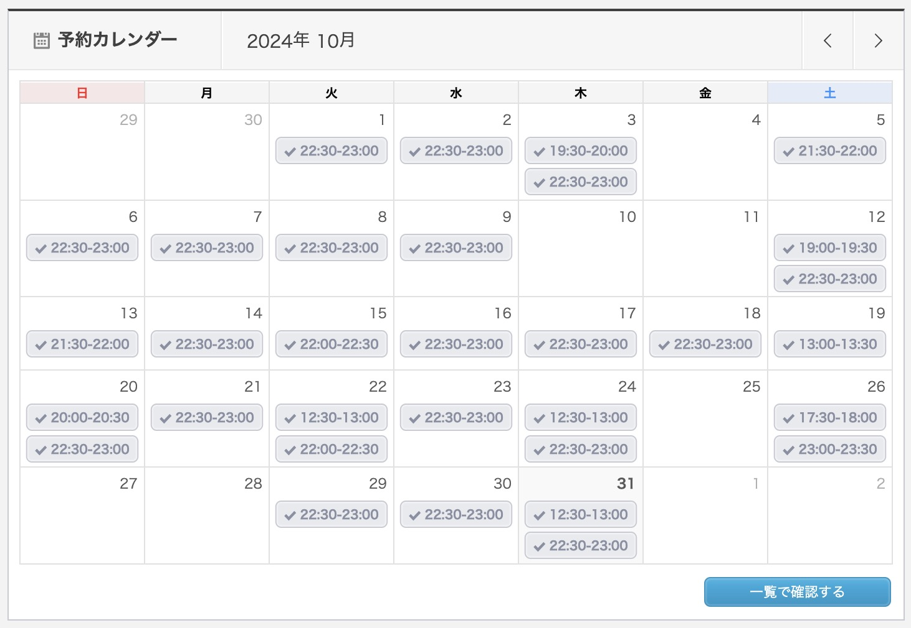

## やったこと

- オンライン英会話 カランメソッド
- オンライン英会話 レアジョブ（Weekly News Article）
- Youtube, Netflix(英語字幕)

### オンライン英会話 カランメソッド

32回受けました。  
ステージ4の29%まで進みました。  
先月はステージ3の81%だったので、48%進められました！！

先月よりしっかり予習してから受けたけど、今回はそれもまたやめました。  
やっぱり負荷が高くて、、、。  
でも、毎日のように受けられてたので、予習なくてもいけました！  
(そもそもカランメソッドは予習不要と言われてます。)

### オンライン英会話 レアジョブ（Weekly News Article）

10回受けました。 

今月も、[Weekly News Article](https://www.rarejob.com/lesson/material/wna/)を主に受けました。

自分が話せそうなトピックのニュースを選んだら楽しく受けられたので、自分の英語レベルの把握って大事だと実感しました。

### Youtube, Netflix(英語字幕)

イマージョンラーニング始めたので、同時字幕をやめました。  
これは勉強に入ってるのか謎だけど、意識して英語を聞き始めた！ということで書きました。

今のところ、ちょうど良いと感じてるアニメやドラマはこれです。  
ミニオンはスラング多めです。

- スポンジボブ
- ミニオン・フィーバー
- エミリー、パリへ行く

あとは好きで観てたのでストーリーが入っていて、英語で観ても苦じゃないアニメと映画はこれです。

- ヴァイオレット・エヴァーガーデン
- ハリーポッター

## 課金しているサービス

### サブスク
| アプリ名 | コース | 料金 |
| ------- | --- | ---- |
| mikan   | Premium | ¥12,000/年 |
| QQEnglish | 月30回コース | ¥11,980/月 |
| レアジョブ | 日常英会話コース 毎日25分プラン | 会社の福利厚生 |

英単語なんもやってないです、、、。  
私には年間支払い向いてないことがわかった。

## 感想

### 気持ち的な面

習慣化はもうできるようになっているのではないかと思います。  
3ヶ月連続で目標のカランメソッド30回、レアジョブ10回受講できてます。

強い意志などないので笑、とりあえず予約する、ということを続けていたら目標達成してました。  
「なんで入れちゃったんだろ、、、」って思うこともかなりあります。笑  
でも結果的に目標達成できてるので、今のやり方を続けていきたいです！

### 英語力

英語力に関しては、最近"just"や"often"など程度を表現できるようになってきました。  
"get"を使う("get tired"とかの)英語らしい表現方法?も使うことができるようになってきました。

わからないときは、ChatGPTに聞きまくってニュアンスの理解を深めたりしてます。  

あとは、カランメソッドで習った文の形式なら言えてる！！って思えることが増えました。

この調子で続けていきたいです。  
AWS re:Inventまであと1ヶ月くらいになったから、11月は英語より頑張りたい！