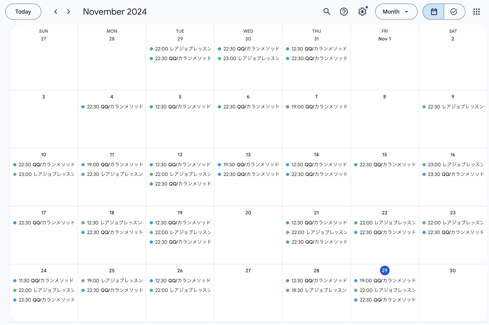

## やったこと

- オンライン英会話 カランメソッド
- オンライン英会話 レアジョブ（実用英会話 レベル4-2, 5-1）
- Youtube, Netflix(英語字幕)
- mikan(スラスラ話すための瞬間英作文シャッフルトレーニング)

### オンライン英会話 カランメソッド

29回受けました。  
ステージ4の66%まで進みました。  
先月はステージ4の29%だったので、37%進められました！！

(全然練習してないからだんだん進みが遅くなってきてる笑)

### オンライン英会話 レアジョブ（実用英会話 レベル4-2, 5-1）

15回受けました。 

今月の途中で実用英会話に戻しました。  
英語勉強法を社内の人に相談したら実用英会話をまずはすべて終わらせるのがおすすめと教えてもらったからです。

ちゃんと予習も取り入れたら良い感じだったので、完走するまで実用英会話を受け続けようと思います。

### Youtube, Netflix(英語字幕)

全部英語はやっぱり精神的にキツくてやめました。(1ヶ月も経ってないけど笑)

代わりに、同時字幕に戻して[`Language Reactor`](https://chromewebstore.google.com/detail/language-reactor/hoombieeljmmljlkjmnheibnpciblicm?hl=ja)のショートカットキーを駆使して学習するようにしました。

- 字幕が終了するごとに自動的に再生を一時停止[`Q` key]
- 前の字幕[`A` key]
- 繰り返す[`S` key]
- 次の字幕[`D` key]

基本的に一時停止はONにして複雑な文章や、逆に、効果音だけの場合はOFFにしています。

気になったらすぐに止められるし何度も繰り返し再生できるのでショートカットキー使って観るのがおすすめです。

自分的には負荷が少なめなので気に入ってます。  
やる気ないときは同時字幕にして止めずに普通に観てます。

### mikan(スラスラ話すための瞬間英作文シャッフルトレーニング)

瞬間英作文をひさしぶりに始めたら、めちゃくちゃ簡単に感じて楽しいので  
ひたすら[この本](https://amzn.asia/d/56FgX7n)進めました。

20日で1周できました。  
mikanアプリでやっているので復習機能使って何周もしていくつもりです。

## 課金しているサービス

### サブスク
| アプリ名 | コース | 料金 |
| ------- | --- | ---- |
| mikan   | Premium | ¥12,000/年 |
| QQEnglish | 月30回コース | ¥11,980/月 |
| レアジョブ | 日常英会話コース 毎日25分プラン | 会社の福利厚生 |

ここにきてmikan再開！！

## 感想

### 気持ち的な面

最近なんと英語が楽しいです！

同時字幕つけながらドラマや映画を観てますが、聞き取れる単語や文章が増えました。  
それが嬉しくて、あと、英語ならではの表現に面白いなって思えるようになってどんどん調べたくなっています。

### 英語力

先月から大きくは変わらずですが、1回レアジョブですごくスムーズに英語が出てきて会話も弾んだときがありました。

調子の良い悪いの波があって、調子良い日はほとんどないですが、それでもスムーズに話せた瞬間があったことに驚きです。  
ここまで半年近く、試行錯誤しながらも英語学習に力を入れてきた成果が少し出てきた気がします。

## 最後に

この調子で続ければ英語話せるようになるぞー、って思えているので引き続き頑張ります。

12月の1週目はAWS re:Invent参加でラスベガスです！！  
楽しみつつ、なるべく積極的に英語を話していきたいです。
