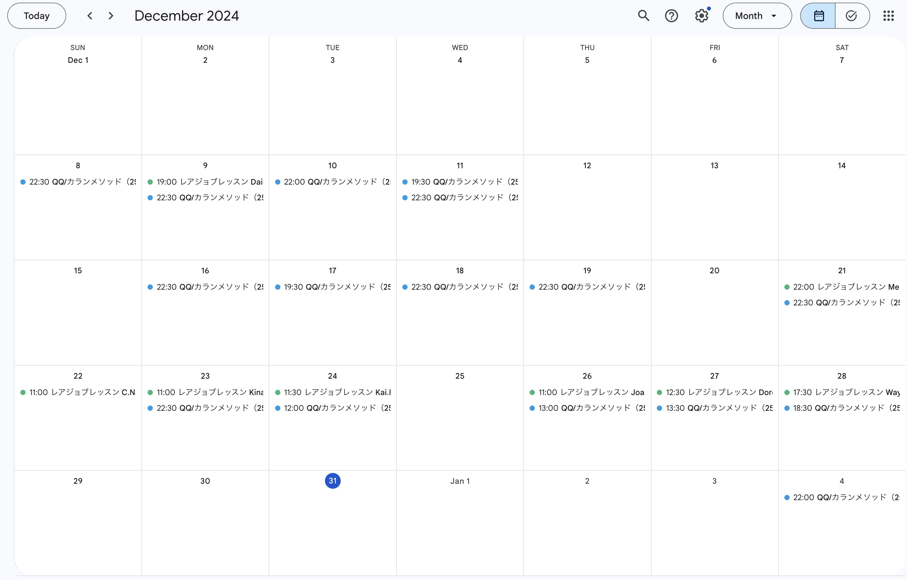

## やったこと

- オンライン英会話 カランメソッド
- オンライン英会話 レアジョブ（実用英会話 レベル5-1）
- mikan(金フレ、金セン、でる1000)

### オンライン英会話 カランメソッド

15回受けました。  
ステージ4の84%まで進みました。  
先月はステージ4の66%だったので、18%進められました。

### オンライン英会話 レアジョブ（実用英会話 レベル5-1）

8回受けました。 

### mikan(金フレ、金セン、でる1000)

TOEICを7月か8月に受けようと思い立って勉強始めました。

金フレは前回も2周くらいしてるから1日400単語くらいできる日もあって良い感じの進捗です。  
でる1000はまだ15%くらいしかできてないし、金センも始めたばかりだからマイペースに進めていきたいです。

## 課金しているサービス

### サブスク
| アプリ名 | コース | 料金 |
| ------- | --- | ---- |
| mikan   | Premium | ¥12,000/年 |
| QQEnglish | 月16回コース | ¥8,480/月 |
| レアジョブ | 日常英会話コース 毎日25分プラン | 会社の福利厚生 |

mikanの良さを再認識！

今月からカランメソッド(QQEnglish)は16回コースにしました。  
もっとやりたいときは別でポイント買うようにしてみます。

## 感想

### 気持ち的な面

今月は1週間、ラスベガスに行ってAWS re:Inventに参加してきました。  
セッションの英語は難しすぎたけど、お店での会話や参加者との会話はなんとかできて良い経験になりました。

悔しい気持ちもあったけど、何より勉強のモチベーションをめちゃくちゃもらいました。  
だから、今月も英語楽しんで勉強できました！

### 英語力

ラスベガスでの1週間はすぐに出てこなくて言えないことも多かったけど、ChatGPTに聞いて次から実践に移せました。  
レアジョブでも長い文章が言えることがあって、本当に微量だけど成長を感じられました。

## 最後に

この調子で勉強続けたら絶対に話せるようになるって思えています。  
まずは分かりやすい達成感と成長のために、TOEIC800点を目指したい。そのあと、IELTSも...。

2025年も頑張ろう。