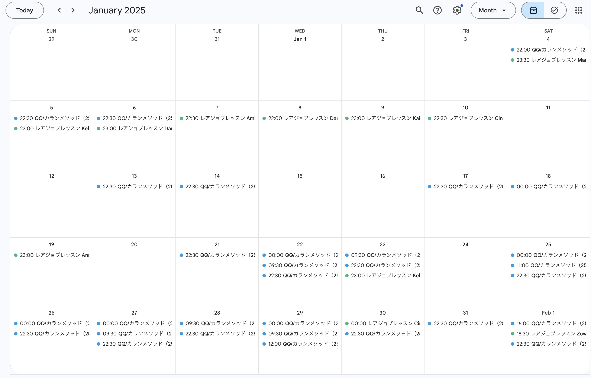

## やったこと

- オンライン英会話 カランメソッド
- オンライン英会話 レアジョブ（実用英会話 レベル5-1）

### オンライン英会話 カランメソッド

28回受けました。  
ステージ4が終わり、ステージ1から4のFULL BOOK RIVISIONに入りました。
ステージ3の後半まで進みました。

### オンライン英会話 レアジョブ（実用英会話 レベル5-1, 5-2）

10回受けました。 

実用英会話 レベル5-2に入りました！

## 課金しているサービス

### サブスク
| アプリ名 | コース | 料金 |
| ------- | --- | ---- |
| mikan   | Premium | ¥12,000/年 |
| QQEnglish | 月16回コース | ¥8,480/月 |
| レアジョブ | 日常英会話コース 毎日25分プラン | 会社の福利厚生 |

カランメソッド(QQEnglish)は2月8日で一旦休会します。

AWSの試験勉強おもったより時間取られるので集中するために、英語に割く時間は少なめにします。  
その代わりに、レアジョブを毎日受けたいと思ってます。

## 感想

### 気持ち的な面

1月早すぎていつの間しか過ぎ去ってました、、、。  

AWSの資格試験に気を取られてあまり英語に意識が向いてなかったのですが、習慣化できていたおかげで変わらず英語の勉強時間が取れてよかったと思います。

### 英語力

QQEnglishを休会することにしたのでカランメソッドを後半詰め込んだらしんどかったです。笑

でも、今までより頻度高く予習もちゃんとしたら間よりスムーズに文章浮かぶようになりました！  
レアジョブでもスムーズに言えることが増えたので効果は感じられました。

## 最後に

1月は前半はお正月気分だったのですが、なんとか勉強モードに切り替えられました。

3月まではAWS資格勉強に集中しますが、英語の勉強も続けていきたいです。